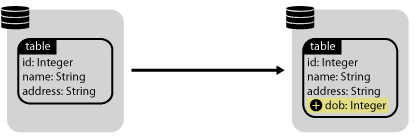

# What are migrations?
Very simply, a migration is the process of taking a database/data store from one state to another. 

# Types of migrations
- Schema migration - the changing of a databases structure (e.g. adding a table, altering a table, deleting a table, etc)
- Data migration - the changing of data in a database (e.g. adding initial data to a database, moving data from one schema to a new schema)

# Django Migrations
The simplest way to create Django migrations are to use `django-admin`

Django admin creates and runs migration files (special Python files) by analyzing changes in your data models. Migration files keep a _'forward'_ and _'reverse'_ path (most supported databases do not support reversing schema migrations)

## Initial migration
Before you can do anything with Django, you need to create an initial migration. This will take an empty or non-existant database and setup initial tables. 

You don't need to write any models to do this as Django creates a few data models to manage migrations and authentication. 

First we need to create a migration file. 

In your project file type `./manage.py makemigrations` or `python manage.py makemigrations` (Windows, Linux)

The migrations for Django's internal apps will be stored in the Django app itself, this is stored internally in your virtual environment. If you created your own data model, you can inspect the model in the `migrations` folder of the same app the `models.py` file is located in. 

After you create migrations, you need to run them by typing `./manage.py migrate` or `python manage.py migrate` (Windows, Linux)

Now you should be able to run Django, create users, access admin. 

## Further migrations
After you create or update a models.py file, you'll need to create and run a migration before you try to run the server. This will add, remove or alter any fields or tables in the database. 

If you don't you'll receive a debug page or 500 error. 
