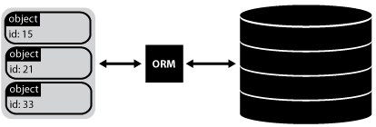

# What is an ORM?

An Object-relational mapping on an abstract level is a technique for converting data between incompatible type. In web development, the term ORM almost synonymous with the tool that converts information from a database into native objects. The ORM generates SQL (or other database query code) automatically based on what methods are called on objects.  

The advantages of using an ORM is that they abstract away the underlying database.  This means that the same web application can be deployed using different database implmentations (SQLite, MySQL, PostgreSQL, Oracle, etc) or even different database types (document stores, relational databases, graph databases). ORMs make creating applications fast and require only one programming language. ORMs also make dealing with foreign and many-to-many relationships very simple. Other advantages include not having to write any SQL, creating complex and multitable queries with ease, performance optimizations and lazy loading (though not all ORMs do this). 

The biggest disadvantage of using an ORM can be performance. Since the ORM is a generic solution and is generically mapping code to queries which can very easily produce inefficient queries. The other major performance problem with ORMs is that they make it simple to do things that would be difficult if dealing directly with the underlying datastore, this and the developer not understanding the underlying datastore can be a major factor in poor performance. There are some very legitimate arguments against using ORMS, see [OrmHate](http://martinfowler.com/bliki/OrmHate.html), [ORM is an anti-pattern](http://seldo.com/weblog/2011/08/11/orm_is_an_antipattern), [The Vietnam of Computer Science](http://blogs.tedneward.com/post/the-vietnam-of-computer-science/), [ORM is an Offensive Anti-Pattern](http://www.yegor256.com/2014/12/01/orm-offensive-anti-pattern.html) 

The equivalent for iOS development is Core Data. The equivalent for Android development would be [Realm](https://realm.io/news/realm-for-android/) or [Sugar ORM](http://satyan.github.io/sugar/).

# The Django ORM
The Django ORM is powerful, includes lazy loading, support for a wide range of relational database management systems (SQLite, MySQL, PostgreSQL, Oracle), the ability to use third party databases (SAP SQL Anywhere, IBM DB2, Microsoft SQL Server, Firebird, ODBC) and even the ability to use other database types (document stores (Mongo), graph databases (neo4j)).

The Django ORM is made up of many parts. The most used are:
- [**Models**](https://docs.djangoproject.com/en/1.10/topics/db/models/) - user defined structure of data
- [**Managers**](https://docs.djangoproject.com/en/1.10/topics/db/managers/) - how models interact with the database
- [**QuerySets**](https://docs.djangoproject.com/en/1.10/ref/models/querysets/) - lazily loaded lists of objects

The ORM usually returns either a QuerySet or a single instance of a model.

### Single object

### QuerySet

## Note
ORMs attempt to abstract away the underlying database, however this is almost an impossible task, because different database engines are implemented differetly and have different features (see [The Law of Leaky Abstractions](http://www.joelonsoftware.com/articles/LeakyAbstractions.html). Using different databases in locally and in production is discouraged as bugs can appear due to the differences in the databases. 

Though Django supports a variety of database engines PostgreSQL is often the recommended database because _"PostgreSQL has the richest feature set of the supported databases"_ and even includes [additional features](https://docs.djangoproject.com/en/1.10/ref/contrib/postgres/) specifically for PostgreSQL that don't work with other engines.

# Resources
[Django Models](https://tutorial.djangogirls.org/en/django_models/) (Django Girls)
[Django ORM and QuerySets](https://tutorial.djangogirls.org/en/django_orm/) (Django Girls)